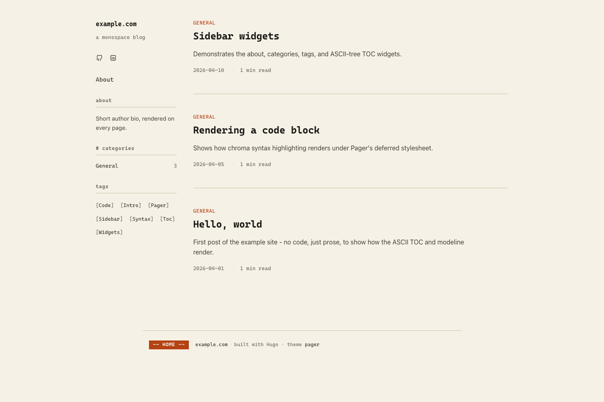
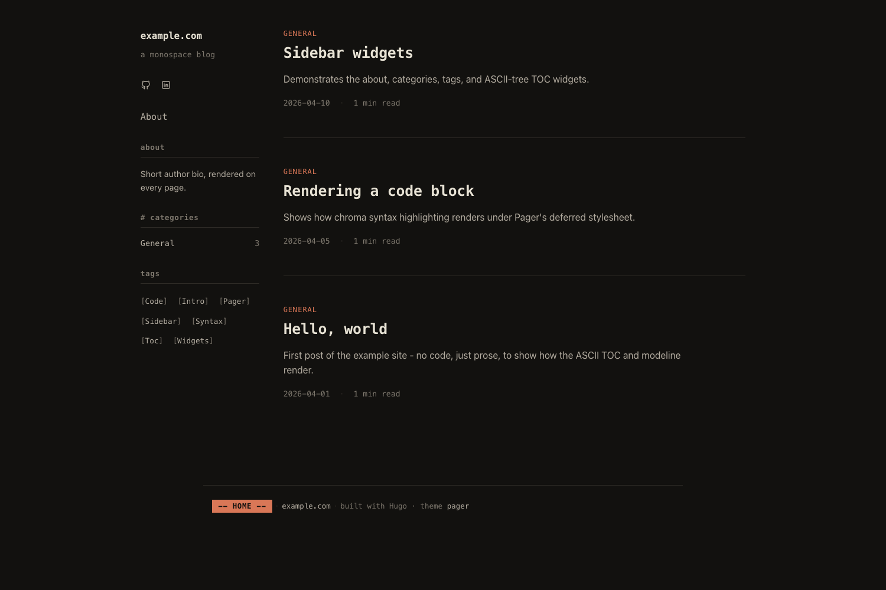

# Pager

A Hugo theme built around a single performance rule: **the critical path of every page fits in the first TCP flight after the handshake (~14 KB Brotli-q11).**

Pager is monospace-first, opinionated, and purpose-built for technical writing. It ships:

- **Zero JavaScript on first paint.** None.
- **Zero web fonts on first paint.** The system stack renders immediately; Cascadia Code swaps in as progressive enhancement with matched metrics (zero CLS).
- **Inlined critical CSS**, external deferred stylesheet with immutable cache.
- **Single left sidebar** carrying header, menu, and contextual widgets (categories / tags / TOC). Main column caps at 80ch.
- **ASCII-tree table of contents** instead of nested bullet lists.
- **Modeline footer** rendered like vim's status bar.
- **Print stylesheet** that turns posts into readable technical papers.

## Aesthetic

Ember/terracotta accent on warm off-white paper (light) or deep ink (dark). `prefers-color-scheme` selects. No purple, no shadows, no rounded cards. Borders where structure demands, negative space elsewhere. Everything snaps to a monospace character grid.

| Light                           | Dark                                |
| ------------------------------- | ----------------------------------- |
|  |  |

## Requirements

- Hugo extended >= 0.160.0 (uses `.Fragments.Headings`, `resources.PostCSS`, `resources.Fingerprint`).

## Install

As a git submodule:

```
git submodule add https://github.com/pszypowicz/hugo-theme-pager.git themes/pager
```

Then in `hugo.toml`:

```toml
theme = "pager"
```

## Quick start

The fastest way to see Pager end-to-end is to copy the bundled example:

```
hugo new site my-blog
cd my-blog
git submodule add https://github.com/pszypowicz/hugo-theme-pager.git themes/pager
cp themes/pager/exampleSite/hugo.toml .
cp -R themes/pager/exampleSite/content/* content/
hugo server
```

`exampleSite/hugo.toml` is a full working config (widgets, menus, markup, permalinks); `exampleSite/content/` has three posts and an about page.

## Parameters

See `exampleSite/hugo.toml` for the full set. Widgets live under `[params.widgets]`:

```toml
[params]
  mainSections = ["post"]

  [params.sidebar]
    subtitle = "Hitchhiking through raw bits"

  [[params.widgets.homepage]]
    type = "about"

  [[params.widgets.homepage]]
    type = "categories"

  [[params.widgets.homepage]]
    type = "tags"

  [[params.widgets.page]]
    type = "about"

  [[params.widgets.page]]
    type = "toc"
```

## Non-goals

Search, comments, galleries, analytics, theme switcher UI, multilingual switcher UI, mermaid diagrams, and smooth-scroll. All deliberately absent. Add them yourself if you need them.

## Credits

- [Cascadia Code](https://github.com/microsoft/cascadia-code) - SIL Open Font License 1.1. Subset WOFF2 files redistributed under the OFL in `static/fonts/cascadia/`.
- Icon paths derived from [Tabler Icons](https://tabler.io/icons) - MIT.

## License

MIT. See [`LICENSE`](./LICENSE).
